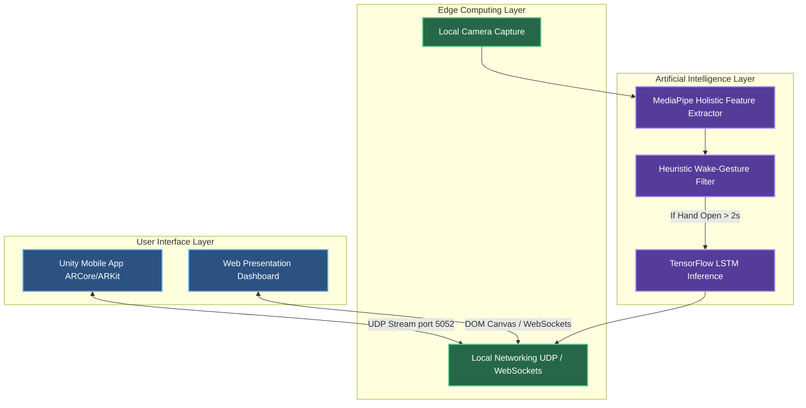
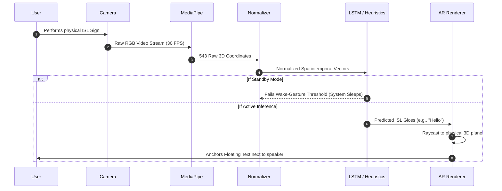

# Bridging the Communication Divide: Real-Time ISL Translation System with AR


##  Project Overview
This project presents a novel, hands-free Augmented Reality (AR) translation system for Indian Sign Language (ISL). By shifting the translation interface into a depth-aware AR environment, the system allows Deaf and Hard-of-Hearing (DHH) individuals to maintain natural eye contact during communication, entirely removing the split-attention effect caused by traditional 2D mobile applications.

The pipeline captures 543 spatiotemporal landmarks using the **MediaPipe Holistic** framework, classifies gestures through mathematically invariant heuristics and **LSTM networks**, and dynamically anchors the translated text in 3D space near the speaker using **Unity AR Foundation** and **Web AR**.

---

##  Technology Stack

###  Artificial Intelligence & Computer Vision
- **MediaPipe Holistic:** 543-point real-time spatiotemporal landmark extraction.
- **TensorFlow & Keras:** Building, training, and running the LSTM sequential model.
- **NumPy & OpenCV:** Matrix manipulations, normalization math, and computer vision.
- **Scikit-Learn:** Model evaluation and F1-metric generation.

### 👓 Augmented Reality & Presentation UI
- **Unity 3D (AR Foundation):** Mobile Augmented Reality deployment using ARCore (Android) and ARKit (iOS).
- **Vanilla JS, HTML5, CSS3:** Zero-dependency presentation dashboard with Web AR canvas rendering.

### 🌐 Networking & Edge Communication
- **UDP Sockets:** Ultra-low latency data transfer between the Python edge backend and the Unity AR frontend.
- **WebSockets:** Real-time bi-directional streaming for the browser dashboard.

---

##  System Architecture

Our project is structured across three distinct computational layers running entirely on the edge device to ensure zero-latency communication without requiring cloud processing.



---

## 🌊 Data Flow Pipeline

The transformation of raw pixel data into physical 3D text follows a strict, highly optimized 5-stage pipeline:



1. ** Standby Mode (Heuristic Wake-Gesture)**
   The camera feed initializes but the heavy AI stays asleep. A lightweight Euclidean heuristic scans the video feed. To activate the system, the user must hold an **Open Hand** steady for 2 seconds. This prevents battery drain during normal conversation pauses.
2. ** Spatiotemporal Extraction (MediaPipe)**
   Once awake, MediaPipe extracts exactly 543 3D landmarks (33 pose, 468 face, 21+21 hand nodes).
3. ** Normalization Phase**
   Coordinates are translated relative to the **Nose landmark (Node 0)** and scaled uniformly based on the Euclidean distance between the shoulders, ensuring scale and translation invariance.
4. ** Inference Engine (Classification/LSTM)**
   The normalized coordinates are passed through either our client-side heuristic engine or the Python LSTM model. Gestures are classified using wrist-to-fingertip distance algorithms to ensure accurate detection regardless of hand rotation.
5. ** AR Anchoring (Unity / Web Canvas)**
   The recognized translation text is mapped from 2D coordinates to 3D physical depth vectors. Unity AR Foundation raycasts this data to anchor the text physically beside the speaker, maintaining eye contact.

---

## ✋ Supported Gestures & Hand Positions

The system currently tracks a vocabulary of distinct, contextually vital ISL/ASL signs. **Before performing any sign, you must wake the system by holding an Open Hand for 2 seconds.**

| Translation Target | The Physical Hand Position Required |
| :--- | :--- |
| **Hello 👋** | **Open Hand:** All 5 fingers extended and spread out. |
| **Thank You 🙏** | **Thumbs Up:** Only the thumb extended, all other fingers tightly curled. |
| **I Love You 🤟** | **Official ILY Sign:** Extend your thumb, index finger, and pinky finger. Keep middle and ring fingers closed. |
| **Peace ✌️** | **Peace Sign:** Index and middle fingers extended in a V-shape, others closed. |
| **Yes ✅** | **Point Up:** Only the index finger extended straight up. |
| **No ❌** | **Closed Fist:** All fingers and thumb tightly curled in. |
| **Toilet 🚽** | **Pinky Only:** Extend *only* your pinky finger. (Universal sign for bathroom/emergency). |
| **Call Me 📞** | **Phone Hand:** Extend your thumb and pinky finger out, middle three fingers closed. |
| **Perfect 👌** | **OK Sign:** Pinch thumb and index finger together, keeping middle, ring, and pinky extended. |
| **Please 🤲** | **Pinch:** Pinch your thumb and index finger together, keeping all other fingers closed. |
| **Water 💧** | **Three Fingers:** Index, middle, and ring fingers extended. |
| **Help 🆘** | **Four Fingers:** All four fingers extended, but thumb tucked into the palm. |

---

## 📂 Repository Structure

```text
ISL-AR-Translation/
├── web_demo/                  #  FULL PRESENTATION UI 
│   ├── index.html             # Dashboard with Architecture, Metrics, and AR UI
│   ├── app.js                 # UI Logic and Simulation Engine
│   ├── camera.js              # 100% Browser-based MediaPipe tracking & classification
│   └── style.css              # Custom CSS styling
├── ai_model/                  # PYTHON BACKEND (Optional/Training)
│   ├── models/                # Saved LSTM weights
│   └── src/
│       ├── data_extraction.py # MediaPipe extraction & normalization
│       ├── model.py           # TensorFlow/Keras LSTM model
│       ├── train.py           # Training pipeline
│       └── inference.py       # Live stream translation
├── unity_ar_app/              # UNITY MOBILE DEPLOYMENT
│   └── Assets/Scripts/
│       ├── ARTextPlacer.cs    # Unity AR Foundation raycasting
│       └── UDPReceiver.cs     # Local networking for AI bridging
└── serve_demo.py              # Local Web Server Launcher
```

---

## 🚀 How to Run the Presentation Demo

The easiest way to present the project with full Web AR functionality (bypassing any Python/Mac compatibility bugs):

1. **Launch the Server:**
   ```bash
   python3 serve_demo.py
   ```
2. **Open the Dashboard:**
   Navigate to `http://localhost:8080` in your web browser.
3. **Presenting:**
   - Scroll to the **Live Translation Console**.
   - Click **▶ Start Simulation** to demonstrate the AR UI flow without a camera.
   - Click **📷 Start Camera** to use the fully client-side MediaPipe engine and demonstrate live tracking with the gestures listed above.

---

## 🌟 Future Scope
- Integration of lightweight quantized **Edge LLMs** to syntactically smooth ISL gloss into grammatically correct English.
- Development of a **3D Bidirectional Avatar** to translate spoken English back into visual sign language.
- A **Hybrid Cloud-Edge architecture** to dynamically load regional ISL dialects on demand.

## 👥 Contributors
- Bhuvan Agrawal (1MS23CI024)
- Ishan Gupta (1MS23CI043)
- Khushi Nawal (1MS23CI057)
- Kr. Aadarsh Suman (1MS23CI059)

**Subject:** CIE644 - Augmented and Virtual Reality  

